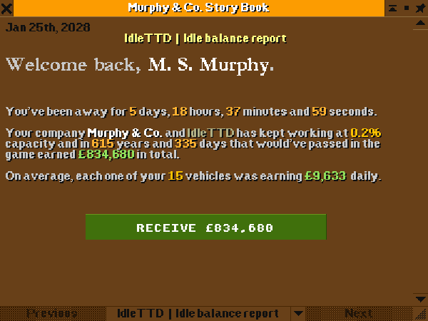
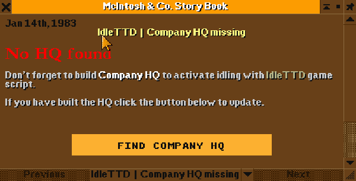
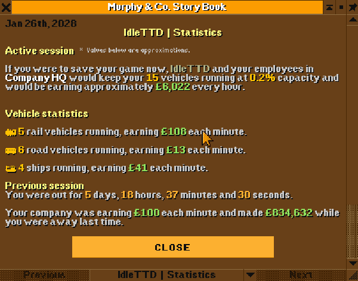

# IdleTTD game script

## Introduction

IdleTTD is a game script that converts _OpenTTD_ into an idle-like game without affecting core gameplay. Players can earn money even when the game is not running.

## Usage

### Installation

Download __IdleTTD__ game script using OpenTTD online content interface.

### Setup

| Name                  | Type / Range  | Default       | Description                               | Note |
| --------------------- | :-----------: | :-----------: | ----------------------------------------- | ---- |
| __idle_multiplier__   | 1 - 10        | __2__         | Multiplier used to calculate idle balance | _Integer value is multiplied by 0.001 (0.1%) to get actual value_ |
| __show_intro__        | `bool`        | __true__      | Enables or disables intro popups          | _Does not affect other story windows._ |
| __show_news__         | `bool`        | __true__      | Enables or disables idle balance news     |  |
| __day_interval__      | 1 - 7         | __1__         | Days to wait before running again         | _For eventual performance tuning._ |

### Running IdleTTD

Set __IdleTTD__ as your active game script, configure it if needed and play the game.

> Script is made only for single player games, won't do anything in multiplayer mode.

### Starting a new game
Intro window will open when new game starts, containing some general info for the player. Other than that, nothing changes in the gameplay until you build Company HQ, save and later load the game. Even the intro window itself can be disabled via script settings.

### Loading a saved game

Upon loading a game saved __IdleTTD__ shows a window with idle balance report for player review.

Once player confirms with the button, their bank balance gets updated.

---

### In-game usage

Player can open closed IdleTTD story book page using the toolbar at any time. All story book pages expect report contain "Help" button that opens help screen with detailed information and help text about IdleTTD.

If player haven't met one of prerequisites for IdleTTD, they will be informed accordingly.

IdleTTD might open a window informing them about Company HQ being required, that they have no valid running vehicles etc.

---

Player can review idle statistics at any moment by opening story book page for IdleTTD.

---

## Support
This script is provided 'as is', no guarantees whatsoever.

#### Building IdleTTD locally

Run `make` in root of the repository and then copy everything from `build` directory to your OpenTTD user directory under `game/IdleTTD`.

### FAQ

#### I started a game and nothing happened!
> You have to enable the intro in game script settings. If intro is disabled, seeing nothing is expected for new games.

#### I loaded my game and nothing happened!
> Make sure you have built a Company HQ and at have at least one vehicle running.

#### I can't close idle report window!
> Idle report window is meant to be closed by clicking the button within (applying idle balance change in the process). If you close it any other way it will just pop up again.

#### I loaded my game and IdleTTD took all my money away!
> Negative idle balance can happen if you lost money a year before game was saved.
